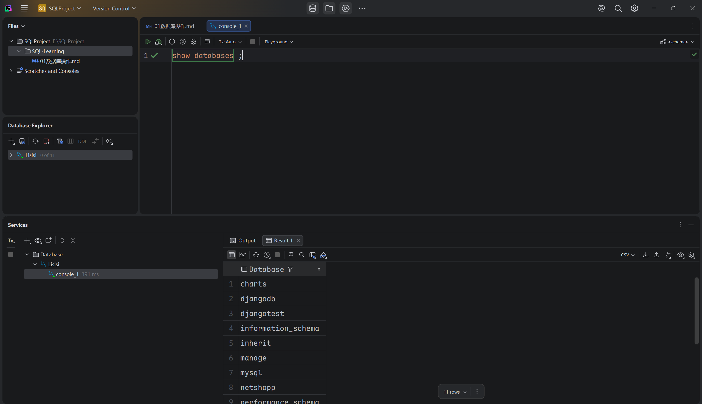
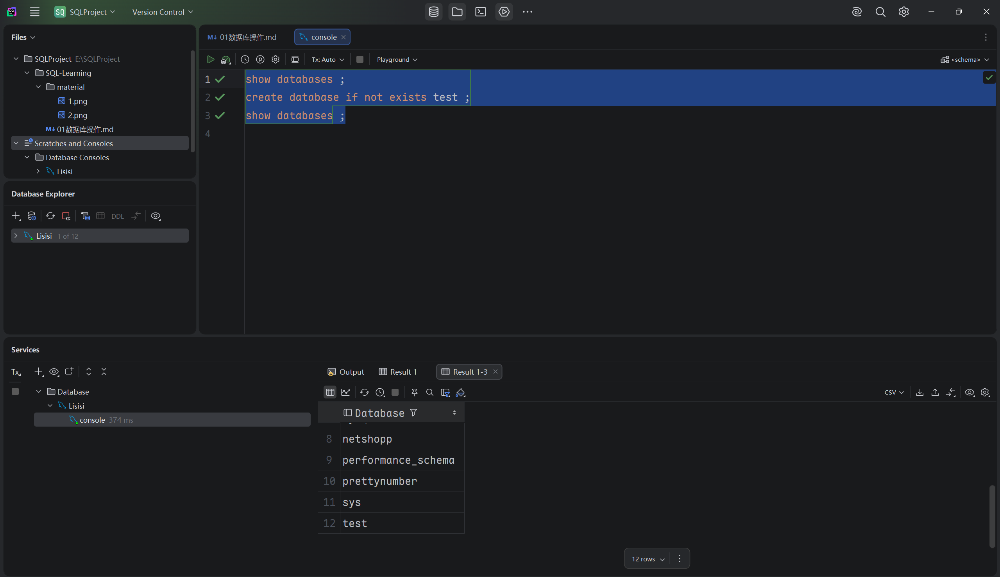
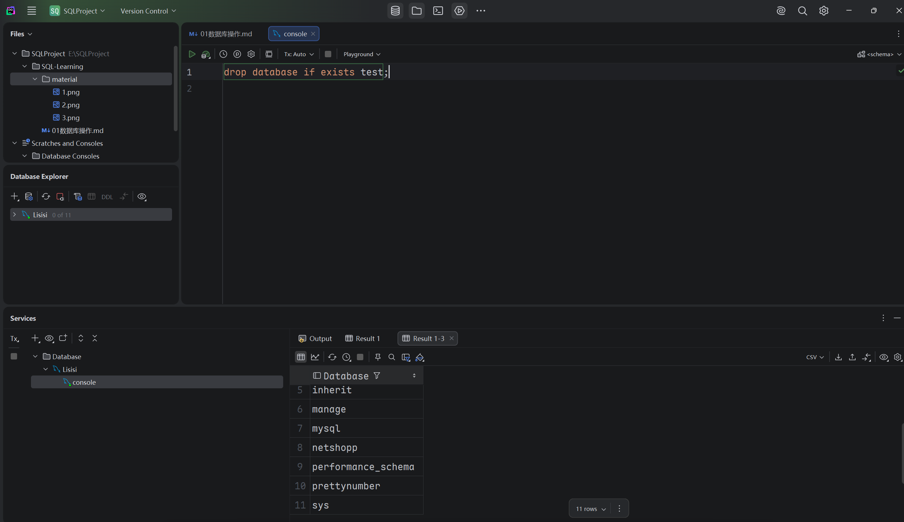
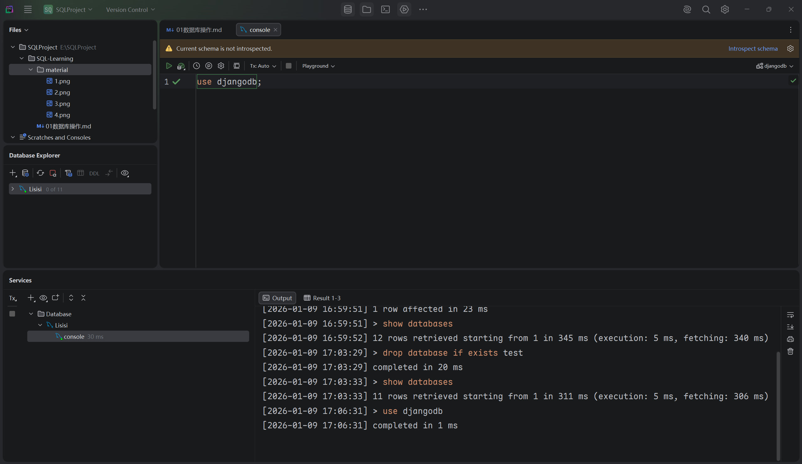

## 数据库操作

- ### 1. 查询数据库

  - #### 查询所有数据库
    ```mysql
    show databases;
    ```
    
    
  - #### 查询当前数据库
    ```mysql
    select database();
    ```
    

- ### 2. 创建数据库
  ```mysql
  create database [if not exists] 数据库名称 [default charset 字符集] [collate 排列顺序];
  ```
  

- ### 3. 输出数据库
  ```mysql
  drop database [if exists] 数据库名;
  ```
  

- ### 4. 使用数据库
  ```mysql
  use 数据库名;
  ```
  