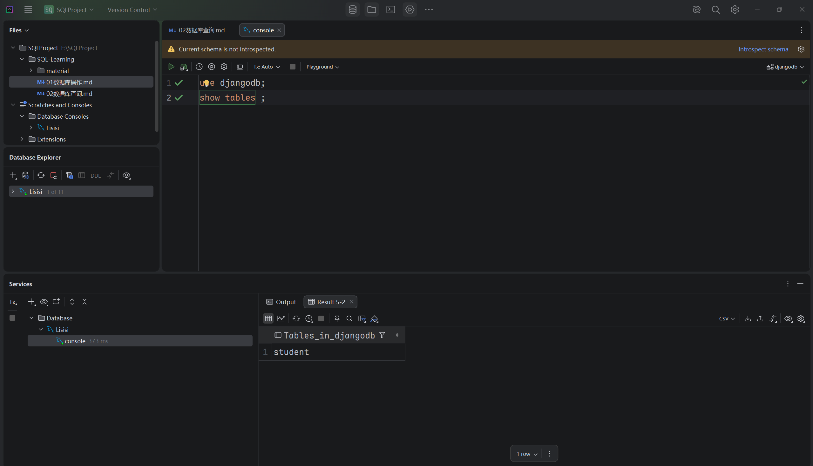
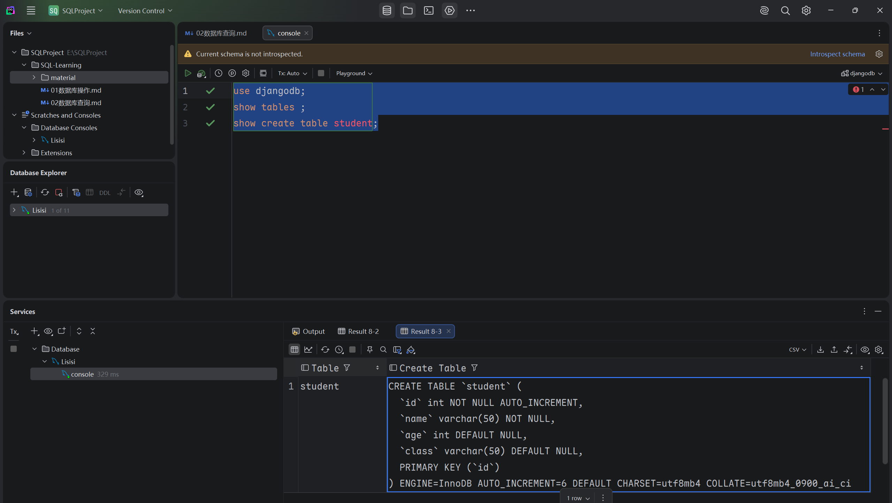
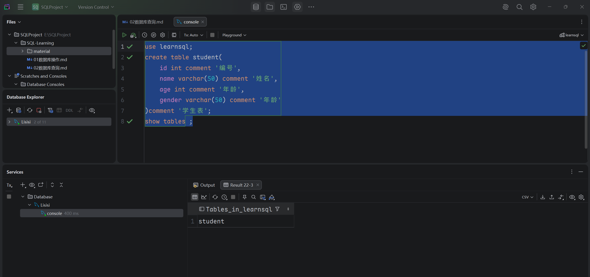

## DDL表查询

- ### 1. 查询当前数据库所有表
  ```mysql
  show tables ;
  ```
  

- ### 2. 查询表结构
  ```mysql
  desc 表名;
  ```
  

- ### 3. 查询指定表的建表语句
  ```mysql
  show create table 表名;
  ```
  

- ### 表的创建
  ```mysql
  create table 表名(
  字段1 字段1类型[comment 字段1注释],
  字段2 字段2类型[comment 字段2注释],
  字段3 字段3类型[comment 字段3注释],
  )[comment 表注释];
  ```
  