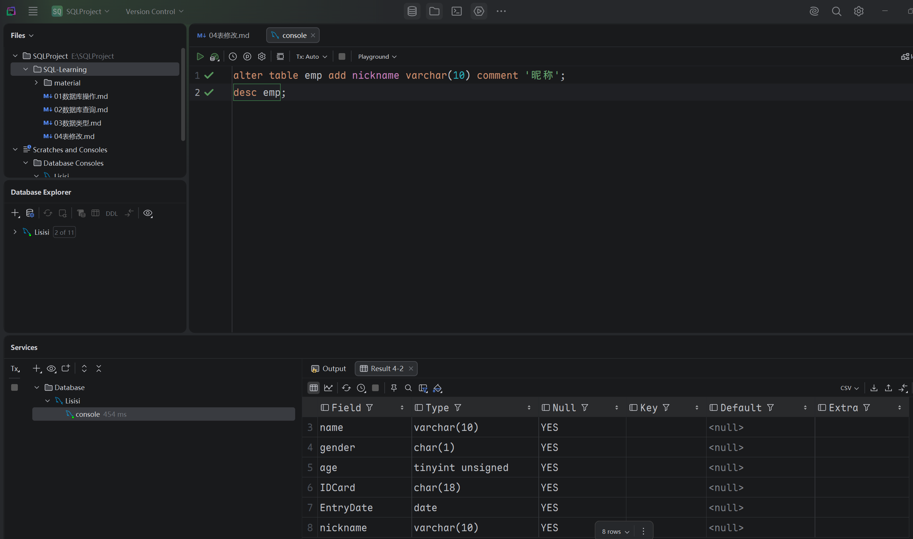
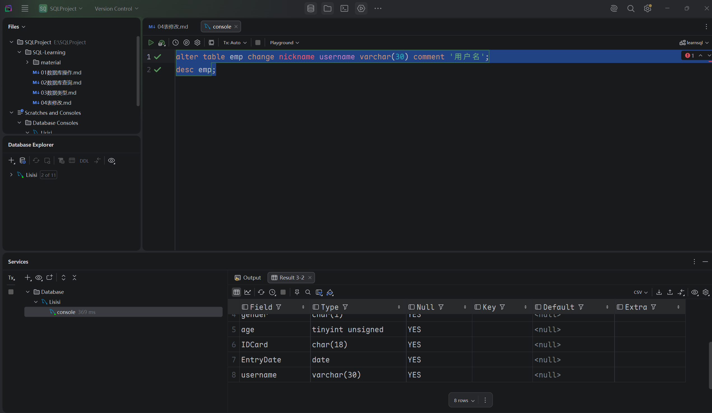
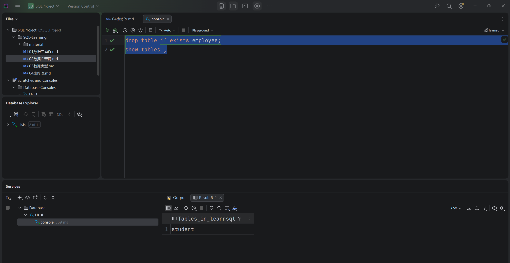
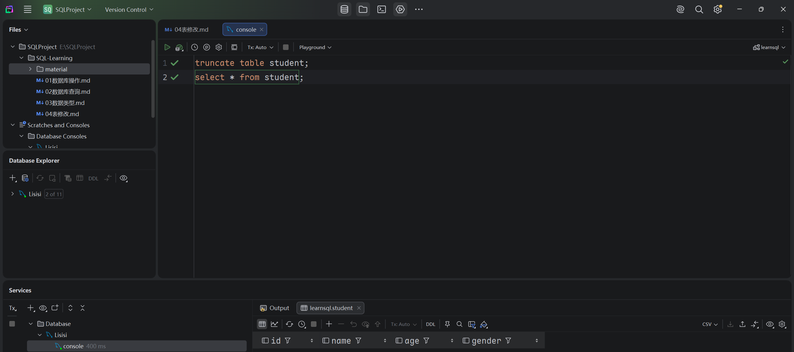

## 表修改

- ### 1. 添加字段
  ```mysql
  alter table 表名 add 字段名 字段类型 [comment 注释] [约束];
  ```
  

- ### 2. 修改
  
  - #### 修改数据类型
    ```mysql
    alter table 表名 modify 字段 新数据类型;
    ```

  - #### 修改字段名和字段类型
    ```mysql
    alter table 表名 change 旧字段名 新字段名 数据类型 [comment 注释] [约束];
    ```
    

- ### 3. 删除字段
  ```mysql
  alter table 表名 drop 字段名;
  ```
  

- ### 4. 修改表名
  ```mysql
  alter table 表名 rename to 新表名;
  ```
  

- ### 5. 删除表

  - #### 删除表
    ```mysql
    drop table [if exists] 表名;
    ```
    
    
  - ### 删除指定表，并且重新创建表
    ```mysql
    truncate table 表名;
    ```
    