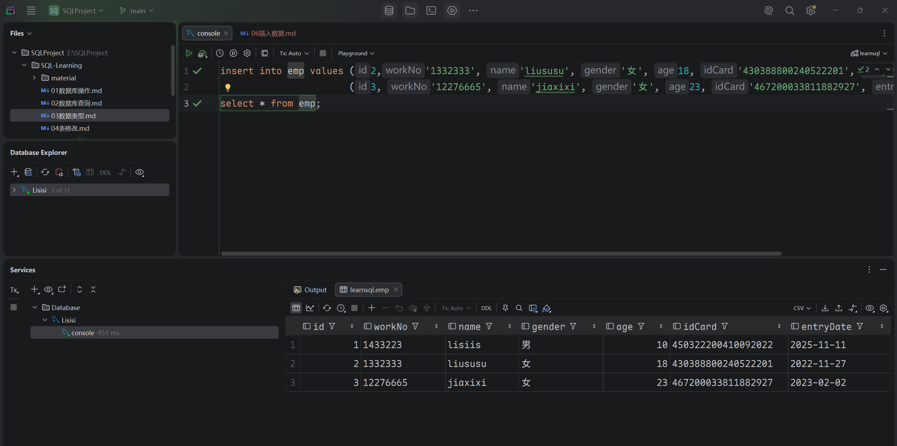

## 插入数据

- ### 1. 给指定字段添加数据
  ```mysql
  insert into 表名(字段名1, 字段名2) values (字段值1, 字段值2);
  ```

- ### 2. 给所有字段赋值
  ```mysql
  insert into 表名 values (值1, 值2, ...);
  ```
  
- ### 3. 批量添加数据
  ```mysql
  insert into 表名(字段1, 字段2, ...) values (值1, 值2, ...), (值1, 值2, ...), (值1, 值2, ...);
  
  insert into 表名 values (值1, 值2, ...),(值1, 值2, ...),(值1, 值2, ...);
  ```
  