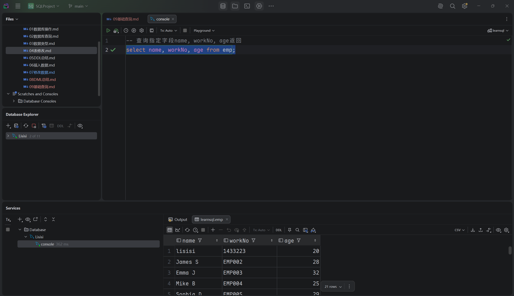
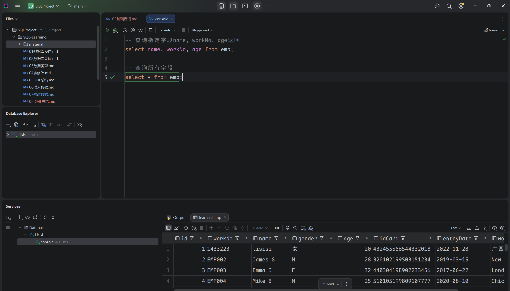
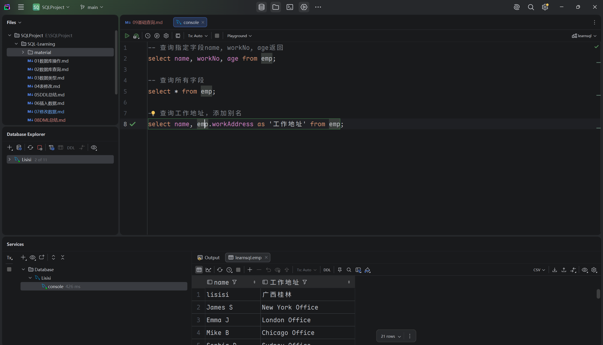

## 基础查询

- ### 1. DQL语法
  ```mysql
  select
    字段列表
  from
    表名
  where
    条件
  group by
    分组字段列表
  having
    分组后条件列表
  order by
    排序字段列表
  limit
    分页参数
  ```
  
- ### 2. 基本查询

  - #### 查询指定字段
    ```mysql
    select 字段1, 字段2 from 表名;
    ```
    
    
  - #### 查询所有字段
    ```mysql
    select * form 表名;
    ```
    
    
  - #### 设置别名
    ```mysql
    select 字段1 [as 别名1], 字段2 [as 别名2] from 表名;
    ```
    
    
  - #### 去除重复之值
    ```mysql
    select disintct 字段列表 from 表名;
    ```
    