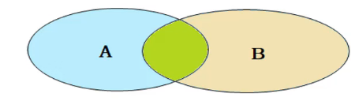

## 多表查询

- ### 1. 多表查询的分类
  - #### 查询连接
    - ##### 内连接：相当于查询A，B表交集部分的数据
    - ##### 外连接
      - ###### 左连接：查询左表所有数据，以及两张表的交集部分
      - ###### 右连接：查询右表的所有数据，以及两表的交集部分
    - ##### 自连接：当前表和自身的连接查询，自连接必须使用表别名
  - #### 子查询
    