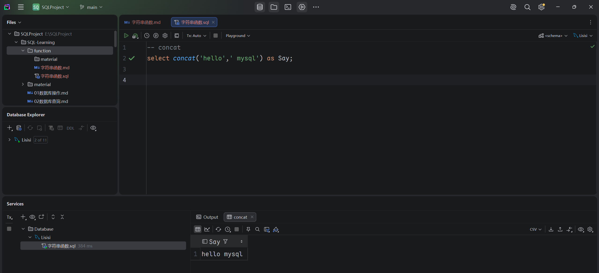
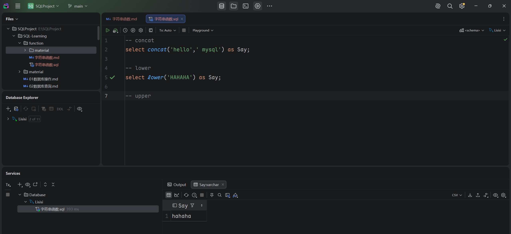
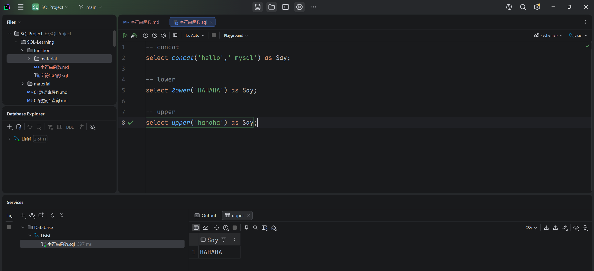
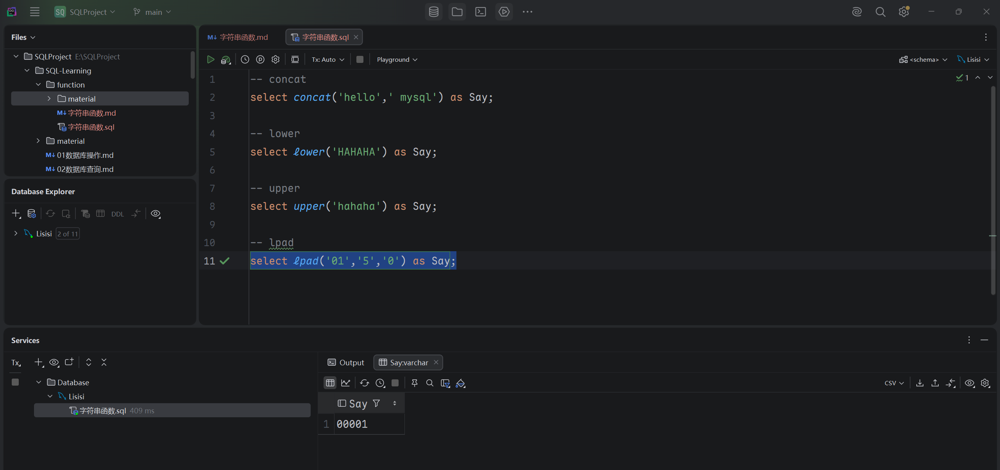
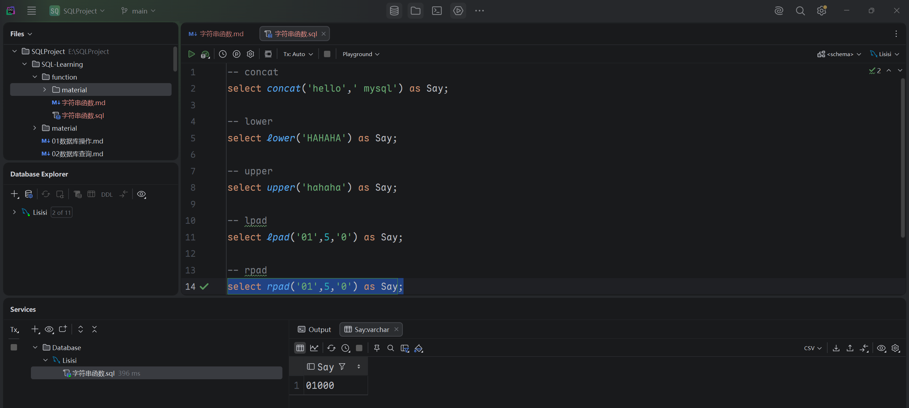
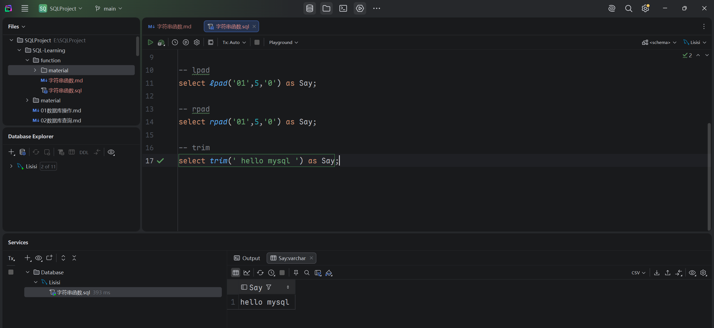
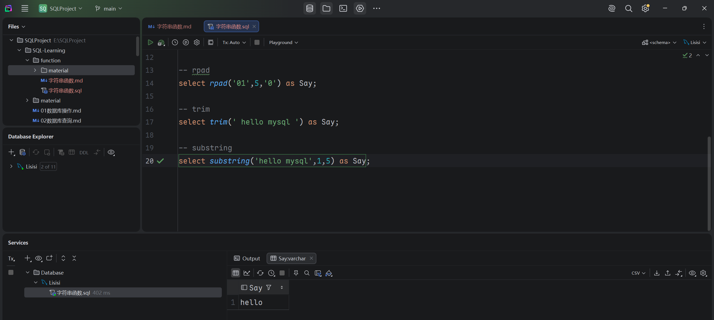

## 字符串函数

- ### 1. 函数
  |            `函数`            |            `功能`            |
  |:--------------------------:|:--------------------------:|
  |      `concat(s1,s2)`       |           字符串拼接            |
  |        `lower(str)`        |         将字符串全部转为小写         |
  |        `upper(str)`        |         将字符串全部转为大写         |
  |     `lpad(str,n,pad)`      | 左填充，使用字符串pad对str进行左填充，达到n位 |
  |     `rpad(str,n,pad)`      | 右填充，使用字符串pad对str进行右填充，达到n位 |
  |        `trim(str)`         |           去掉首尾空格           |
  | `substring(str,start,end)` |    返回字符串start到end位置的字符串    |

- ### 2. 示例

  - ### concat
    
  
  - ### lower
    

  - ### upper
    

  - ### rlap
    

  - ### rpad
    

  - ### trim
    
  
  - ### substring
    

